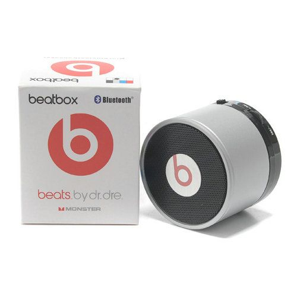

I was reading one of [rldane]()'s [30 Days of Gratitude](https://rldane.space/a-september-theme-30-days-of-gratitude.html) posts and it inspired me to write my own.

This blog has been stagnant for quite some time anyway (read: never got off the ground) and thinking and writing about the things I'm grateful for seems like a fairly easy thing to do while not being completely uninteresting to whomever will read this (hi benni from the future 🙋🏻‍♂️).

I wanna start my series of posts detailing what I'm grateful for in life with something I'm incredibly grateful for (duh).

I'm grateful for **music**.

Coincidentally, I'm listening to ["Thank You" by half•alive](https://youtu.be/wybMvM2ywsw) right now.

Music has had a big impact on my life. It has continually accompanied me throughout a large portion of my life and it has shaped who I am today.

The first time I remember listening to music was when I was eight or nine years old.
My sister had come back from a vacation in Turkey and she got me a small Beats Bluetooth speaker. It looked similar to this one, except mine had a RGB LED ring at the top:

My brother wanted to test the sound quality and played [About A Mile's "Trust You All The Way"](https://www.youtube.com/watch?v=u4p7-zlyQ9M) — the first song I actively listened to.

From that moment on I fell in love with music.
I listened to music every opportunity I got (which, admittedly, weren't very many for young Benni).

I went through many different phases of artists over the years. I spent hours listening to Lecrae, LZ7, NF (which sometimes left my parents concerned for me), Hillsong Young & Free, Ren (which definitely left my parents concerned for me, sorry mom, sorry dad. Entschuldigung!), and finally one band I landed on recently: twenty one pilots.

During my NF phase - he had just released his album HOPE and was touring - I got to see him in concert which was incredibly cool! I'll never forget the time in Hamburg with my siblings. The day after the concert we went sightseeing which was sick. 

Aside from just seeing him in concert for HOPE, the album, and specifically the song [HAPPY](https://www.youtube.com/watch?v=r0MqadBYOso) had a much bigger impact on my life.

The album released in a pretty dark time of my life and the song [God through the song] met me just in the right moment.

The song met me where I was:
> I feel more comfortable
> Living in my agony 

It made me realize what the truth was (and still is):
> Truth is I need help 

And described my situation perfectly:
> Dear God, please, 
> Hear me out, I know it's been a couple years
> Since I've reached out and said hello 

I could go on and on about how much of an impact music had on my life 
## sub-thankfulness: live performances
One of, if not *the best* live performance among the artists I regularly listen to has to be the [Downstairs performance at the Bellwether by twenty one pilots](https://youtu.be/zcZMQZbPMxM).

It means so much to me.

The video has gorgeous mixing, mastering and editing of both sound and visuals (the live version of the song feels ALIVE!).

But the most impactful moment of the whole video takes place in the last one minute and a half.

Tyler jumping down from the piano, ending the song on his knees. His head tilted towards the sky.

> Cause I want to be the one after your own heart 
> And I might doubt the process like I doubt the start 
> You can have all I've made and all I've ever known
> You can have both my lungs if you ask me so

I could go on and on about the last few seconds of the song and this video. I could go on and on about twenty one pilots and how they point to Christ again and again, but I'll spare you of that and I'm saving it for another time.

While still listening to the song and writing this blog post, I've found half•alive performing Thank You live: https://youtu.be/bTb7VtvUnSg

I genuinely have no idea how I was able to multitask this hard but I did it. Yay.

Music has had an unimaginably big impact on my life. I made who I'd call my absolute best friends though the [Matthew Parker](https://youtube.com/@matthewparkertunes) Discord "server". I spent some really fun days with friends and family and made memories for live though concerts. I've found refuge and shelter in both written lyrics as well as melodies, instruments moving air and that air hitting my eardrums, words sung.

Music is something I'm grateful for beyond measure — and that's an understatement.

***

I just noticed I plagiarized the entirety of [this post by sir rl](https://rldane.space/gratitude-day-6-music.html) :/ oops.
